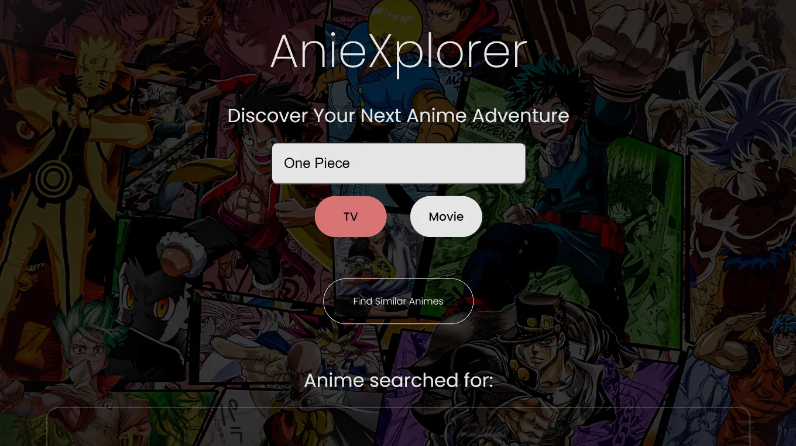

# 🚀 Rohan's 3D Portfolio



🎯 A dynamic, visually-rich portfolio highlighting full-stack capabilities, 3D rendering, and real-time interactivity.

---

## 🌐 Live Demo

🔗 [View Portfolio](https://portfolio-3d-nu-woad.vercel.app)

---

## 🛠️ Tech Stack

| Frontend | 3D Engine | Styling | Deployment |
|----------|-----------|---------|------------|
|  |  |  | Vercel / GitHub Pages |

## ✨ Features

- 🌌 3D model rendering with `@react-three/fiber` + GLB integration
- 🧠 AI-powered project logic (e.g., anime recommendation system)
- ⚡ Performance-tuned with lazy loading, Suspense, and code splitting
- 📊 Integrated with **Google Analytics** and **Vercel Speed Insights**
- 🧩 Responsive, animated cards using GSAP and custom CSS
- 💾 Hosted on GitHub Pages with optional Vercel support

---

## 📂 Project Structure

```bash
.
├── public/
│   └── models/, images/
├── src/
│   ├── components/
│   ├── sections/
│   ├── constants/
│   ├── App.jsx
│   └── main.jsx
├── tailwind.config.js
├── vite.config.js
├── index.html
└── README.md
```

---

## ⚙️ Setup Instructions

```bash
# 1. Clone the repo
git clone https://github.com/yourusername/Portfolio-3D.git
cd Portfolio-3D

# 2. Install dependencies
npm install

# 3. Run locally
npm run dev

# 4. Build for GitHub Pages
npm run build
npm run deploy
```

---

## 🚀 Deployment

Supports both:
- ✅ GitHub Pages (`gh-pages -d dist`)
- ✅ Vercel (`vercel deploy --prod`)

---

## 🧠 Credits

Inspired by [Bruno Simon](https://bruno-simon.com/) and the Three.js community for interactive design.

---

## 🤝 Contributing

Pull requests are welcome! For major changes, please open an issue first to discuss what you would like to change.

---

## 📄 License

MIT © [Rohan](https://github.com/ro-rok)
